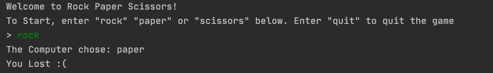

# Rock Paper Scissors Program #

## Description: ##
This program is a simple implementation of the classic game "rock paper scissors." This was created in the Java language as a simple way of learning functions, loops and boolean expressions. To play, simply enter "rock", "paper", or "scissors" and see if you win. The program will notify you if you have won, lost or tied. I hope you all enjoy.

## Development Environment: ##
This program was written in Java. To compile and use this program, first you must to download the Java JDK, either the [commercial](https://www.oracle.com/java/technologies/javase-downloads.html) or the [open source](https://jdk.java.net/) versions.

After one of those JDK versions is downloaded, download and IDE like [IntelliJ](https://www.jetbrains.com/idea/) to compile and run the program.

## How to Build/Execute the program: ##
After downloading [IntelliJ](https://www.jetbrains.com/idea/), open the folder containing the files of the program. Once the project opens, you should be able to run and compile the program by pressing the green play button in the top right corner of the window.

## Screenshots: ##

## Useful Websites: ##
* [W3 Schools Java](https://www.w3schools.com/java/)
* [Learn Java in 14 minutes](https://www.youtube.com/watch?v=RRubcjpTkks&t=559s)
* [Java Booliean Expressions](https://www.w3schools.com/java/java_booleans.asp)
